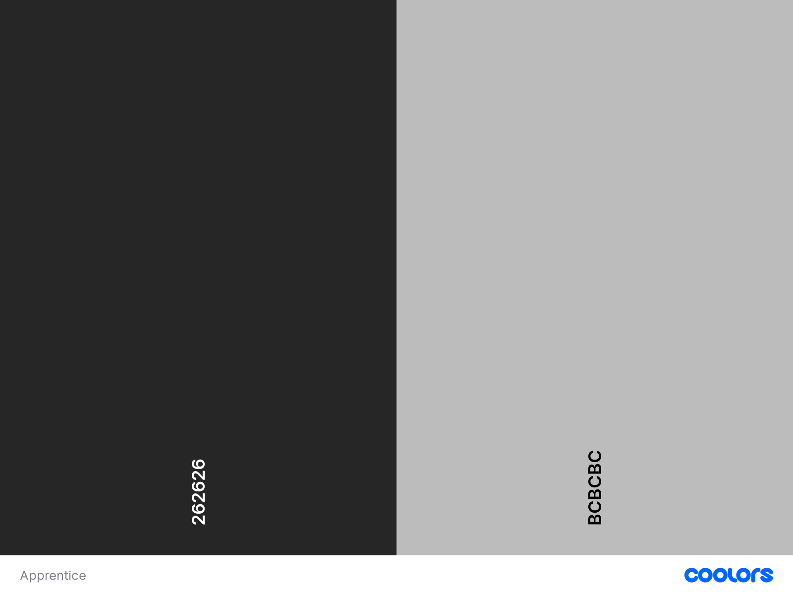
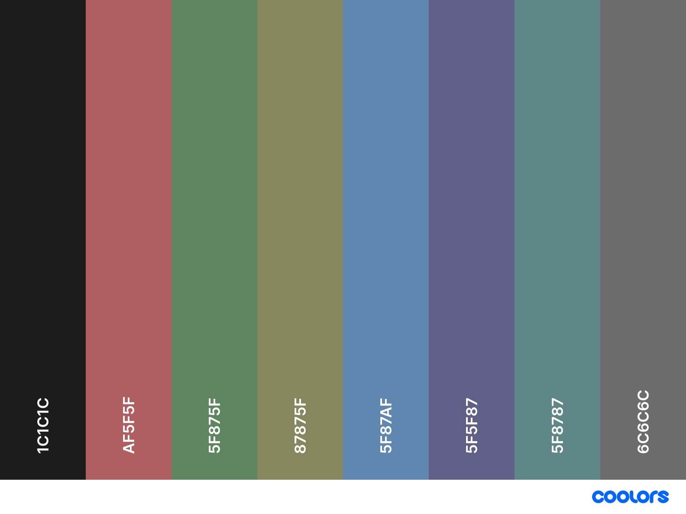
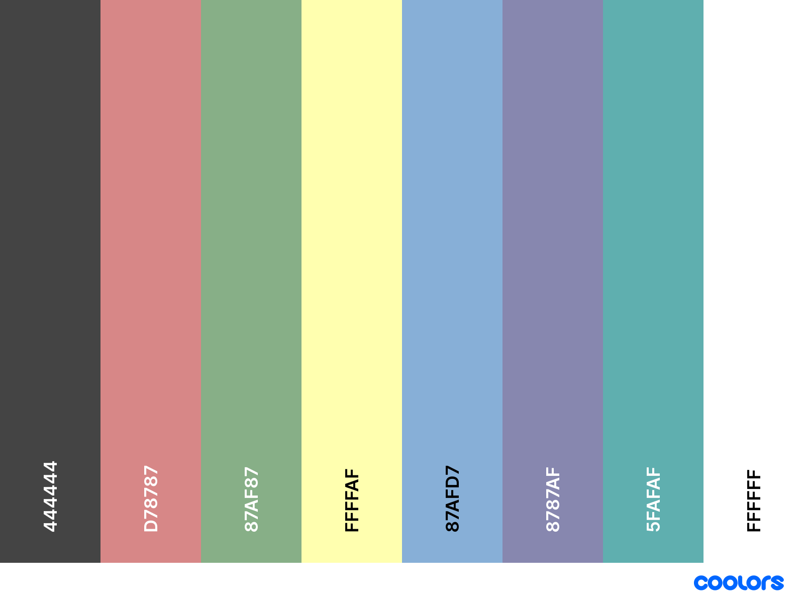
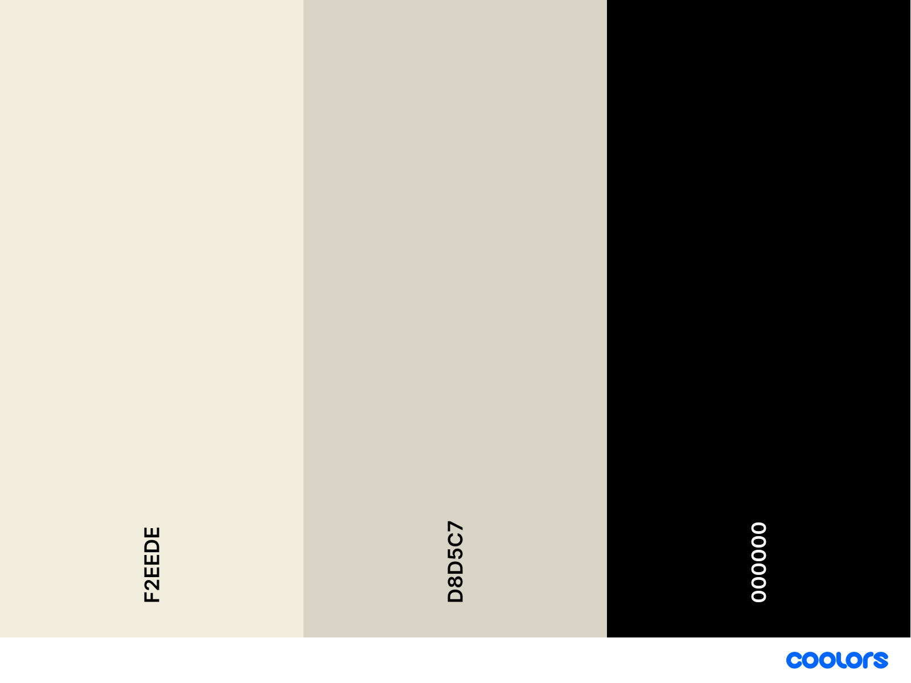
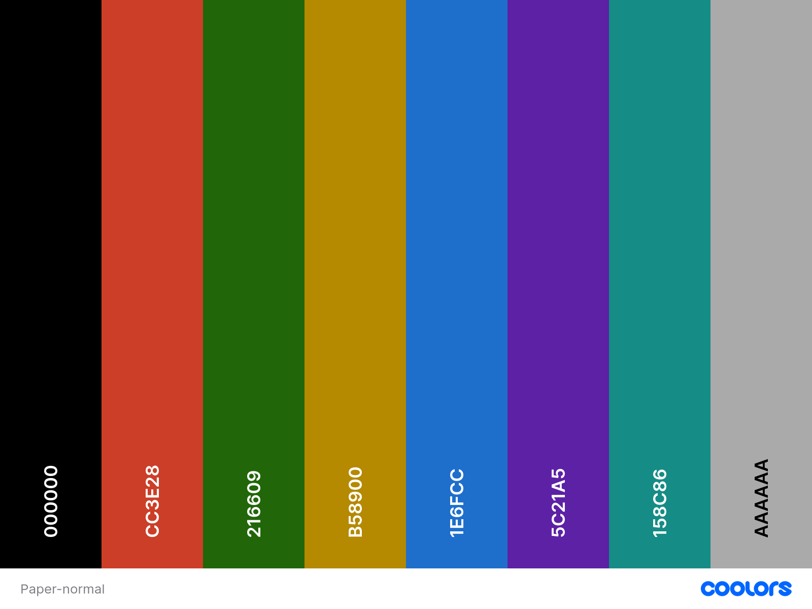

# Colorshemes

## Apprentice

```INI
background = #262626
foreground = #BCBCBC
```



> [coolors visualization](https://coolors.co/262626-bcbcbc).

## Normal (Apprentice)

```INI
black   = #1C1C1C
red     = #AF5F5F
green   = #5F875F
yellow  = #87875F
blue    = #5F87AF
magenta = #5F5F87
cyan    = #5F8787
white   = #6C6C6C
```



> [coolors visualization](https://coolors.co/1c1c1c-af5f5f-5f875f-87875f-5f87af-5f5f87-5f8787-6c6c6c).

## Bright (Apprentice)

```INI
black   = #444444
red     = #D78787
green   = #87AF87
yellow  = #FFFFAF
blue    = #87AFD7
magenta = #8787AF
cyan    = #5FAFAF
white   = #FFFFFF
```



> [coolors visualization](https://coolors.co/444444-d78787-87af87-ffffaf-87afd7-8787af-5fafaf-ffffff).

## Paper

```INI
background_1 = #F2EEDE
background_1 = #D8D5C7
foreground   = #000000
```



> [coolors visualization](https://coolors.co/262626-bcbcbc).

## Normal (Paper)

```INI
black   = #000000
red     = #CC3E28
green   = #216609
yellow  = #B58900
blue    = #1E6FCC
magenta = #5C21A5
cyan    = #158C86
white   = #AAAAAA
```



> [coolors visualization](https://coolors.co/000000-cc3e28-216609-b58900-1e6fcc-5c21a5-158c86-aaaaaa).
